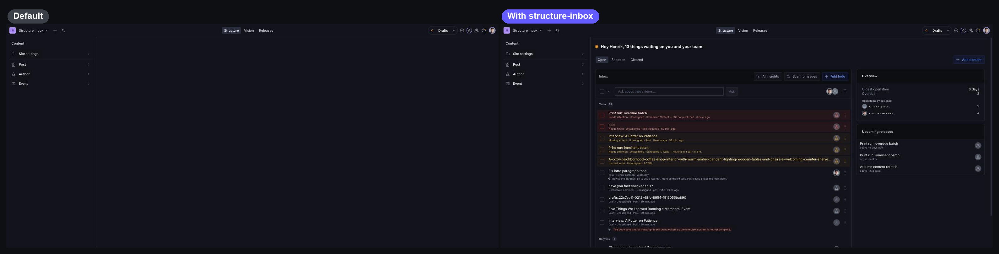
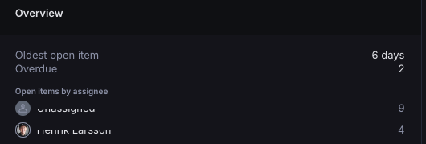
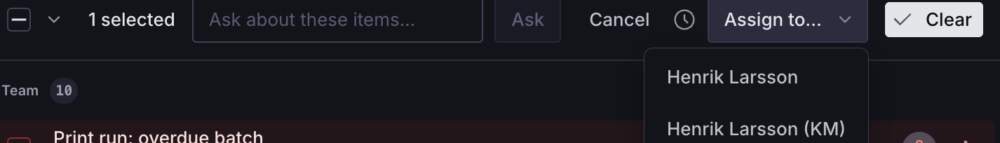
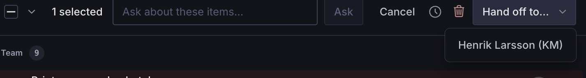
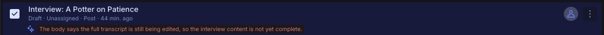
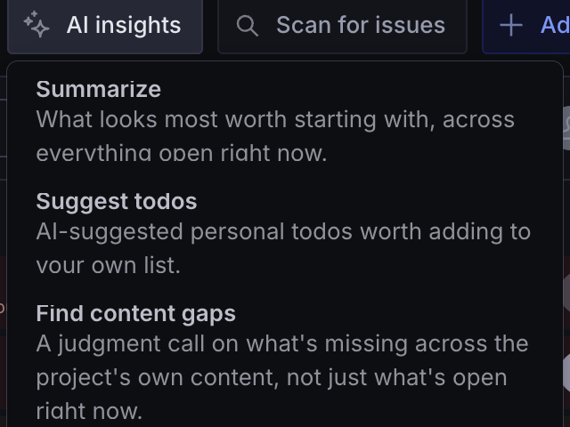
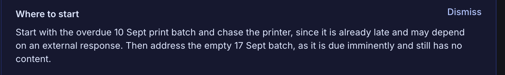
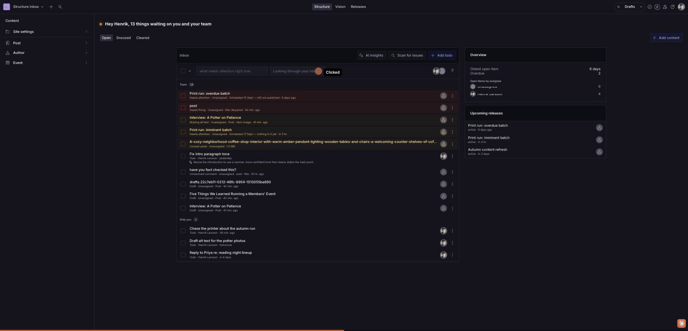

# sanity-plugin-structure-inbox

[](https://www.npmjs.com/package/sanity-plugin-structure-inbox)
[](https://www.npmjs.com/package/sanity-plugin-structure-inbox)
[](./LICENSE)


Turns the empty Structure canvas into an inbox. Drafts left unpublished, releases coming up, tasks
assigned to you, and whatever else you feed it, merged into one list sorted by what needs attention
first. It sits on the screen editors already land on, so nobody has to go looking for it, and every
row can be opened, handed to a colleague, snoozed or ticked off without leaving the pane.



> **Requires Sanity Studio v6.**

## Installation

```sh
npm install sanity-plugin-structure-inbox
```

## Usage

Add it to `plugins` in `sanity.config.ts`, **after** `structureTool()` — order matters, since the
plugin extends the structure tool already in the array:

```ts
import {defineConfig} from 'sanity'
import {structureTool} from 'sanity/structure'
import {
  openTasks,
  structureInbox,
  unpublishedDrafts,
  upcomingReleases,
} from 'sanity-plugin-structure-inbox'

export default defineConfig({
  // ...
  plugins: [
    structureTool(),
    structureInbox({
      sources: [openTasks(), unpublishedDrafts({olderThanDays: 7}), upcomingReleases()],
    }),
  ],
})
```

Editors now land on the Inbox instead of a blank canvas. Nothing is added to your structure tree —
the plugin teaches the root pane to resolve the Inbox id directly.

> `openTasks` and `upcomingReleases` above only show real rows on a plan that actually has Tasks
> and Content Releases (see the plan requirements in the table below) — on a plan without them,
> that source just quietly renders nothing rather than an error. `unpublishedDrafts` works on every
> plan, so it's a safer first source to reach for if you're not sure what your plan includes yet.

## Sources

A source is a feed of inbox items. Eight ship with the plugin, plus one more (last row) via a
separate, optional integration:

| Source                                             | What it lists                                                      | Whose      |
| --------------------------------------------------- | -------------------------------------------------------------- | ---------- |
| `openTasks({limit, onlyMine, clearedWithinDays})`    | Sanity Tasks assigned to you and still open (requires the [Growth plan](https://www.sanity.io/pricing) or above). | Yours      |
| `unpublishedDrafts({olderThanDays, limit, types, onlyMine})` | Drafts that have sat untouched long enough to look forgotten. | Everyone's |
| `upcomingReleases({limit})`                          | Releases that are scheduled or still being filled (requires [Content Releases](https://www.sanity.io/pricing), an Enterprise add-on). | Everyone's |
| `needsAttention({limit})`                            | Releases that are overdue, empty and imminent, or stalling (same Content Releases requirement as above). | Everyone's |
| `documentValidation({limit, types})`                 | Drafts currently failing their own schema's validation rules.    | Everyone's |
| `assetIssues({limit, maxSizeBytes, altFieldName})`    | Oversized, unused, or poorly alt-texted image/file assets.        | Everyone's |
| `unresolvedComments({limit, onlyMine})`               | Unresolved comment threads (requires the [Growth plan](https://www.sanity.io/pricing) or above). | Yours |
| `todos({title, placement})`                          | A personal scratch list you type into, right in the pane.        | Yours      |
| `linkCheckerFindings()`                              | Broken references and dead links — separate entry point, see below. | Everyone's |

Sources choose their column with `placement`: `main` (default) merges every main source's items
into one sorted list; `aside` gives a source its own small card in the narrow right column, for
context worth seeing but not acting on (`upcomingReleases` defaults here). The aside column
disappears entirely once every aside source is empty. Main-column rows sort by tone, then by
longest-waiting first.

A persistent Overview card (oldest open item, next snooze wake, overdue count, open items by
assignee) appears in the aside column once the open list is long enough for a breakdown to say
something the list itself can't — below ~12 open items it stays out of the way.



Most sources declare `audience`: `openTasks`/`unresolvedComments` default to `onlyMine: true`
(a task or a thread naturally belongs to someone); `unpublishedDrafts` defaults to `onlyMine:
false` (a forgotten draft is usually the team's problem). `todos` has no team-wide reading at all.

A few operational notes worth knowing before you configure sources:

- **`openTasks`/`unresolvedComments`** read from the Studio's addon dataset (the one Sanity Tasks
  and Comments already use) — a Studio that's never used either shows an empty section, not an
  error. Both rely on `@beta`/`@internal` Sanity APIs, reached defensively so a removal shows an
  error card for that source instead of failing the whole Studio to boot.
- **`assetIssues`'s "unused" check** is skipped (reports zero rows) once a project has more than
  200 total assets, to avoid a slow query.
- **`linkCheckerFindings`** needs [`sanity-plugin-link-checker`](https://www.sanity.io/plugins/sanity-plugin-link-checker)
  installed and is imported from its own entry point — see [Optional: broken
  links](#optional-broken-links-via-sanity-plugin-link-checker) below.

### Assigning an item to someone else



Most sources offer `assign`: select rows, pick a name from the **Assign to…** picker. This is
delegation, not ownership — a row doesn't need one natural owner to be worth assigning. Two
sources don't offer it: `openTasks` already has its own native (read-only, here) assignee field,
and `todos` has no shared document to label — it offers `transfer` ("Hand off to…") instead, for
handing your own todos to someone else before you leave a team.



With exactly one row selected, `unpublishedDrafts` and `unresolvedComments` also show a fact-based
suggestion above the picker (most recent editor, or the thread's own `@mention`) — never
pre-selected, always just one more click away from the picker itself.

### Asking AI about an item



`unpublishedDrafts` offers `assess`: click **Ask AI** on a row for a one-line read via Sanity's
Agent Actions — "looks ready to publish", "still missing a hero image." Informational only; it
never writes to the document.

### Writing your own

```tsx
import {type InboxSource} from 'sanity-plugin-structure-inbox'

export function needsReview(): InboxSource {
  return {
    name: 'needsReview',
    title: 'Waiting for review',
    placement: 'main',
    useItems() {
      const client = useClient({apiVersion: '2025-02-19'})
      // ...fetch, then:
      return {
        items: rows.map((row) => ({
          id: row._id,
          title: row.title,
          subtitle: 'Submitted for review',
          timestamp: row._updatedAt,
          intent: {type: 'edit', params: {id: row._id, type: row._type}},
        })),
      }
    },
  }
}
```

`useItems` is a plain React hook — reach for `useClient`, `useCurrentUser`, or any Studio hook you
need. Return `resolve` to make a tick complete the item for real (see below); return `create` to
offer an "Add" dialog; return `remove` for sources with no `resolve` that still need a way to clear
an item out for good. A source can also offer `useOpenCount(snoozes, now)`, read by the exported
`useInboxOpenCount()` hook for a live count usable anywhere in the Studio (e.g. a navbar badge):

```tsx
import {useInboxOpenCount} from 'sanity-plugin-structure-inbox'

function MyBadge() {
  const count = useInboxOpenCount()
  return count ? <Badge>{count}</Badge> : null
}
```

## Selecting and acting

Ticking a checkbox **selects** a row; the action bar then lets you choose what happens, spanning
the whole merged list at once (mix a task and a draft in one selection).

- **Open** — everything not resolved and not snoozed.
- **Cleared** — only items a source itself confirms are resolved with real evidence (today, only
  `openTasks`). Never populated by an editor ticking something.
- **Snoozed** — hidden until a chosen time, or until the item changes underneath the snooze,
  whichever comes first. **Wake now** brings one back early.
- **Acknowledge** — a personal, non-binding "I've seen this" marker (a small checkmark), for
  sources with no `resolve`. The item stays in Open regardless, and the mark expires if the item
  changes afterward.

The confirm button reads **Mark as done** for a source with `resolve` (completes the item where it
lives, e.g. closes the task), or **Acknowledge** for one without (a draft, a release, a todo) — a
mixed selection does both at once. `unpublishedDrafts` also offers **Suggest a time** next to
Snooze: an explicit click sends the document to Agent Actions for a date-aware suggestion, never
applied without a second click.

Acknowledgments, snoozes and todos each live in their own small, unregistered per-editor document
(`structureInbox.dismissals.<userId>`, `.snoozes.<userId>`, `.todos.<userId>`) — plain, queryable
documents in your dataset, not hidden anywhere.

### Recipe: a digest outside the Studio

These per-editor documents make a scheduled digest (a daily "here's what's open" email or Slack
message) a job for a [Sanity Function](https://www.sanity.io/docs/content-lake/webhooks) — not
something this package ships, but `buildDigest` is exported to make writing one straightforward:

```ts
import {buildDigest, parseSnoozes} from 'sanity-plugin-structure-inbox'

const editors = await fetchEditorsWithParsedState(client) // your own fetch + parseSnoozes per editor
const sources = await fetchConfiguredSourceItems(client) // your own fetch, shaped as {name, items}[]

const digests = buildDigest(sources, editors)
// digests: {userId, open: InboxItem[]}[] — send however you'd like.
```

### Recipe: cleaning up after a departed editor

The per-editor documents above persist forever once created. `findStaleEditorDocuments` diffs them
against your project's current membership so you can clean up orphaned ones on your own schedule:

```ts
import {EDITOR_DOC_TYPES, findStaleEditorDocuments} from 'sanity-plugin-structure-inbox'

const docs = await client.fetch(`*[_type in $types]{_id, _type}`, {types: EDITOR_DOC_TYPES})
const activeUserIds = await fetchCurrentProjectMemberIds() // your own fetch, e.g. Sanity's project members API

const staleIds = findStaleEditorDocuments(docs, activeUserIds)
// staleIds: string[] — delete however and whenever you like, e.g.:
// await client.delete({query: '*[_id in $ids]', params: {ids: staleIds}})
```

## Options

| Option              | Type            | Default           |                                                                                   |
| ------------------- | --------------- | ------------------ | ---------------------------------------------------------------------------------- |
| `sources`           | `InboxSource[]` | `[]`               | The feeds that fill the inbox, in order.                                          |
| `title`             | `string`        | localized `Inbox`  | Title for the pane, and for its list item when shown.                             |
| `toolName`          | `string`        | `'structure'`      | Which structure tool to attach to. Set this when the Studio runs more than one.   |
| `showInList`        | `boolean`       | `false`            | Whether to show an "Inbox" entry at the top of the root list.                     |
| `redirectOnLanding` | `boolean`       | `true`             | Whether to open the Inbox when an editor lands on the tool with nothing selected. |
| `ask`               | `boolean`       | `false`            | Lets an editor select rows by asking a plain-language question. See below.        |
| `contentGaps`       | `object`        | off                | Enables the "Find content gaps" AI read. See below.                               |
| `context`           | `string`        | —                  | Project description prepended to every AI read. See below.                       |
| `summarize`         | `boolean`       | `true`             | Set to `false` to remove the "Summarize" AI read entirely — no menu item, no cost. |
| `suggestTodos`      | `boolean`       | `true`             | Set to `false` to remove the "Suggest todos" AI read entirely — no menu item, no cost. |

### Getting back to the Inbox

Editors land on it, and clicking the tool in the navbar returns them to it. For a visible entry,
`showInList: true` puts one at the top of the root list — or use `inboxListItem` to place it
somewhere specific:

```ts
import {inboxListItem} from 'sanity-plugin-structure-inbox'

structureTool({
  structure: (S) =>
    S.list()
      .title('Content')
      .items([...S.documentTypeListItems(), S.divider(), inboxListItem(S)]),
})
```

## AI features, and what they cost

Every source, `assign`/`transfer`, resolve/acknowledge/snooze, and both digest recipes work with
**zero AI and zero Sanity Agent Actions usage** — the pane is fully useful with no AI configured at
all. AI is additive on top of that, never required:

| Feature                                 | Where                          | Default | Triggered by            |
| ---------------------------------------- | ------------------------------- | ------- | ------------------------ |
| **Ask AI** (`assess`)                    | Per row, on `unpublishedDrafts` | —       | Explicit click            |
| **Suggest a time** (`suggestSnooze`)     | Per row, on `unpublishedDrafts` | —       | Explicit click            |
| **Summarize**                            | Pane-wide                      | On      | Explicit click            |
| **Suggest todos**                        | Pane-wide                      | On      | Explicit click            |
| **Ask** (`ask: true`)                    | Pane-wide                      | Off     | Explicit click, per question |
| **Find content gaps** (`contentGaps: {}`)| Pane-wide                      | Off     | Explicit click            |

Every one of these is click-triggered, never automatic — nothing fires just from selecting a row
or opening the pane, and every handler is guarded against a rapid double-click firing twice.



**Summarize** answers the question an inbox can't answer by being a list — what, out of all this,
is most worth starting first:



Sanity bills Agent Actions at a flat **$0.05 per request**, regardless of document or prompt size —
cost scales with how many times editors click these buttons, not with how many documents or how
much content you have. `summarize`/`suggestTodos` are on by default since they're cheap and
low-friction; turn either off (see [Options](#options)) for a config-level guarantee of zero spend
from that read, regardless of what an editor clicks.

## Grounding AI reads in your project

```ts
structureInbox({
  context: 'A design agency site — services, case studies, and a blog.',
  sources: [
    /* ... */
  ],
})
```

`context` is optional prose describing your project's business or positioning, prepended to every
pane-wide AI read (Summarize, Suggest todos, Ask, Find content gaps) — not per-row reads like
**Ask AI**, which already ground themselves in one concrete document. Keep it short, concrete, and
stable (business model, terminology) rather than anything that goes stale (a current campaign) —
outdated context actively misleads.

To keep it out of `sanity.config.ts` itself, load it from a file — Sanity Studio runs on Vite, so a
plain [`?raw` import](https://vite.dev/guide/assets.html#importing-asset-as-string) works:

```ts
import projectContext from './project-context.md?raw'

structureInbox({context: projectContext, sources: [/* ... */]})
```

Turning off **Summarize** or **Suggest todos** (see [above](#ai-features-and-what-they-cost))
removes the menu item entirely, so no request is ever sent:

```ts
structureInbox({summarize: false, suggestTodos: false, sources: [/* ... */]})
```

## Optional: broken links via `sanity-plugin-link-checker`

[`sanity-plugin-link-checker`](https://www.sanity.io/plugins/sanity-plugin-link-checker) scans your
dataset for dangling references and dead external links. `linkCheckerFindings()` reads its report
as an Inbox source — imported from a **separate entry point**, so `sanity-plugin-link-checker`
(an optional peer dependency) is only required if you actually use it:

```ts
import {structureInbox} from 'sanity-plugin-structure-inbox'
import {linkCheckerFindings} from 'sanity-plugin-structure-inbox/link-checker'

export default defineConfig({
  plugins: [
    structureTool(),
    structureInbox({sources: [/* ...your other sources */, linkCheckerFindings()]}),
  ],
})
```

`sanity-plugin-link-checker`'s own `linkChecker()` Studio tool is not required — this integration
reads and runs scans directly from that plugin's headless engine. Add `linkChecker()` yourself only
if you also want its standalone panel or CLI.

By default only confirmed-broken links show up, not `unverifiable` ones (a browser-only check
without that plugin's Document Function deployed). Pass `includeUnverifiable: true` once that
Function is deployed, or if the noise is acceptable for your project.

## Optional: asking about all your items

```ts
structureInbox({ask: true, sources: [/* ... */]})
```



With `ask` on, a single-line "Ask about these items…" input appears in the Open view. Type a
plain-language question and AI selects which on-screen rows match it — a selection only, never a
resolve/dismiss/snooze on your behalf. Off by default: it spends an Agent Actions request per
question, and needs Agent Actions available in the Studio. Ask runs the same project-wide survey
`contentGaps` (below) is built on, regardless of whether `contentGaps` is enabled — when both are
on, the survey is shared and short-TTL-cached (5 minutes) between the two, so asking a question
right after finding content gaps (or vice versa) doesn't survey your dataset twice.

## Optional: finding content gaps

```ts
structureInbox({
  contentGaps: {},
  context: 'A design agency site — services, case studies, and a blog.',
  sources: [/* ... */],
})
```

With `contentGaps` configured, a **Find content gaps** button appears next to Summarize. It surveys
every real document type in your schema and asks AI what looks missing given what's actually
there. `context` matters most here of any read in this pane. This is a judgment call, not a fact
(unlike every other source), and the heaviest read in the pane — off by default for both reasons.
Read-only: there's no "draft this for me" yet.

## How it works

The plugin registers a `studio.components.activeToolLayout` override that redirects an editor
landing on the tool's root pane to the Inbox pane's id, then wraps the root's child resolver so
that id actually resolves. It stands aside on a deep link, mid-intent, or in tools it's not
attached to.

**Limitation:** a structure resolver that returns an _observable_ can't be extended this way — rare,
but if you do, the plugin warns and disables the redirect rather than sending editors to a URL that
resolves to nothing.

## Localization

Strings live under the `structureInbox` i18n namespace. Override any of them by registering a bundle
with that namespace in your own `sanity.config.ts`:

```ts
import {defineLocaleResourceBundle} from 'sanity'

i18n: {
  bundles: [
    defineLocaleResourceBundle({
      locale: 'sv-SE',
      namespace: 'structureInbox',
      resources: {'inbox.title': 'Start'},
    }),
  ],
}
```

## Develop & test

The repo ships a test Studio as an npm workspace.

```sh
npm install
cp test-studio/.env.example test-studio/.env   # then fill in a project id
npm run build                                  # required — see below
npm run dev                                    # http://localhost:3333
```

The test Studio consumes the plugin's `dist/`, not `src/`, so **a source change is invisible until
you rebuild**. For a tighter loop, run `npm run link-watch` in one terminal and `npm run dev` in
another.

Other scripts: `npm test`, `npm run lint`, `npm run format`, `npm run typecheck`.

## License

MIT © Henrik Larsson
